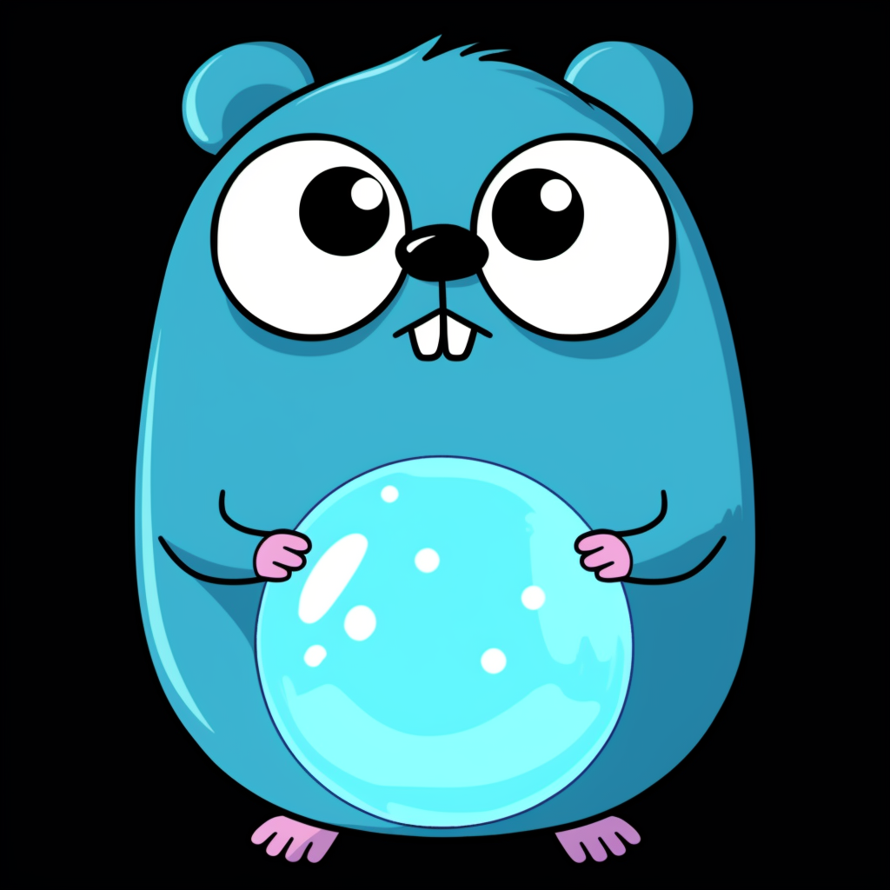

# GOracle - A User-Friendly Go Library for LLMs



## Overview

GOracle is a convenience library designed to help Golang developers bring the power of (LLMs) into their Go applications. Our goal is to provide a straightforward and efficient experience for Go developers by offering a common API layer that abstracts the complexities of various LLM platforms down into the client layer, while providing a small stable interface.

It's designed to be small, simple, and powerful!

In fact, this README was ghost written by an LLM, with a lot of oversight from his human editor.
Check out the [code here](examples/readme/main.go)! 

## Features

- Simple interaction with LLMs from Go applications.
- Compatibility with multiple large language models such as OpenAI's GPT and Google's VertexAI.
- Support for diverse types of reference materials (text, images, and files).
- State management features for sustained conversations and context control.
- Extensible design for adding new LLM providers in the future.

## The Ask Method

The `Ask` method is the core function of GOracle. It allows developers to pose questions to an LLM and receive a response. This method takes a question as a string input and optional reference arguments. These references can be used to provide additional context to the LLM in various forms such as text, images, or file content.

### Usage Example

```go
ctx := context.Background()
c := client.NewChatGPT("your-token-here")
o := oracle.NewOracle(c)
response, err := o(ctx, "What is the capital of France?")
if err != nil {
    log.Fatal(err)
}
fmt.Println(response)
// Response: Paris!
```

## Reference Concept

A reference in GOracle provides context to the LLM to assist with generating an accurate and relevant response. References can be text excerpts, image data, or file contents that inform the LLM about the context or domain of the question being asked.

### Supported Types

- Textual content as strings or bytes.
- Images represented in Go's `image.Image` interface.
- File content using byte slices with file-reader functionality.

### Using References

References can enhance the quality of the LLM's responses by providing relevant examples or additional data. You can include references when using the `Ask` method.

### Reference Usage Example

```go
ctx := context.Background()
imageRef := // ... some image.Image object
fileRef := oracle.File("example.txt")
stringRef := "some big mess of text"

response, err := oracleInstance.Ask(ctx, 
    "Can you analyze the content of these references?", 
    imageRef, 
    fileRef,
    stringRef,
)
if err != nil {
    log.Fatal(err)
}
fmt.Println(response)
```

Please note that GOracle only serves as a convenience tool for LLM integrations and does not include the actual language models. Users are required to have proper access to the LLM platforms (like OpenAI or Google Cloud's VertexAI) with necessary API keys or tokens configured.

**Users should also be aware that GOracle has no awareness of billing, so in the interests of your hip pocket, set the appropriate hard caps or limits on spending!**

We hope GOracle empowers you to build out your Golang applications with the powerful capabilities of LLMs, bringing complex language understanding and generation features to your user base. Enjoy the simplified experience of using LLMs in your next project!
